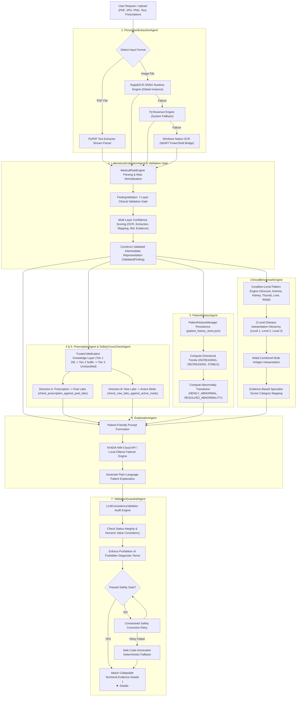

# Agentic AI Methodology & System Architecture

This document details the **Agentic AI Architecture**, **Deterministic-First Validation Gate**, **Longitudinal Patient Analytics**, **Bidirectional Safety Engine**, and **Benchmark-Grounded Reasoning** governing the **Medical Report Analyzer & Prescription Assistant** application.

---

## 🤖 Visual Agentic AI Architecture

The platform operates as a hybrid **Deterministic-First, Multi-Agent Orchestration Pipeline**. Generative AI models are strictly scoped as natural language explanation and translation agents, while clinical status determinations, unit verifications, evidence tracking, medication-lab safety cross-checks, and condition-level pattern matches remain 100% governed by deterministic, testable code engines.

---

## 🔬 Specialized Executable Agent Pipeline Details

### 1. **`PerceptionExtractionAgent` (Data Perception & OCR Extractor)**
- **Multi-Engine Pipeline**: Prioritizes native PDF stream extraction via `PyPDF`, then `RapidOCR` ONNX runtime engine, falling back to `PyTesseract` or `Windows Native OCR (WinRT)` via PowerShell bridge.
- **Line Metadata Capture**: Captures 1-indexed line numbers (`source_line_number`), raw line snippets (`raw_source_line`), and line-level OCR confidence scores.

### 2. **`LaboratoryEvaluationAgent` & 7-Layer `FindingValidator`**
- **Validated Intermediate Representation (`ValidatedFinding`)**: Converts raw extracted text into structured clinical objects containing `finding_id`, `test_name`, `normalized_test_name`, `result_value`, `result_text`, `unit`, `reference_low`, `reference_high`, `reference_text`, `status`, `evidence_text`, `source_line`, `extraction_confidence`, `validation_status`, `validation_errors`, `source_location`, `rule_id`, `provenance_source`, `provenance_status`, `measurement_type` (`DIRECT` vs `DERIVED`).
- **7-Layer Clinical Validation Gate**:
  1. *Test Name & Analyte Association Validation*: Prevents attaching `Mean Blood Glucose` (e.g. `121.6 mg/dL`) to `HbA1c` (%) or header noise words.
  2. *Unit Compatibility Validation*: Analyte-specific unit checking (`ANALYTE_VALIDATION_REGISTRY`).
  3. *Reference Range Integrity*: Rejects incompatible reference ranges (e.g. neonatal Creatinine ranges attached to Sodium) and falls back to `Configured Default Reference Range`.
  4. *Evidence Link Integrity*: Verifies `raw_source_line` against analyte keywords and filters document header/address noise (`"JANANASHANKARA"`, `"Bypass Road"`).
  5. *Derived Value Detection*: Automatically marks calculated values (e.g. `Mean Blood Glucose (eAG)` derived from `HbA1c`) as `DERIVED`.
  6. *Multi-Layer Confidence Metrics*: `overall_confidence = min(ocr, extraction, mapping, reference, evidence)`.
  7. *Fault-Tolerant Status Assignment*: Assigns `VALIDATED`, `PARTIALLY_VALIDATED`, `AMBIGUOUS`, `UNVERIFIED`, `REVIEW_REQUIRED`.

### 3. **`PatientHistoryAgent` (Longitudinal Trend Analytics)**
- **Multi-Visit Store (`PatientHistoryManager`)**: Stores only validated laboratory findings across visits.
- **Trend Computation**: Computes directional trends (**`INCREASING_TREND`**, **`DECREASING_TREND`**, **`STABLE_TREND`**) and transition patterns (**`NEWLY_ABNORMAL`**, **`PERSISTENTLY_ABNORMAL`**, **`RESOLVED_ABNORMALITY`**).

### 4 & 5. **`PrescriptionAgent` & `SafetyCrossCheckAgent` (Bidirectional Safety Engine)**
- **Trusted Medication Knowledge Layer**:
  - *Tier 1 (Exact DB Match)*: Known drug lookup in `TRUSTED_MEDICATION_DATABASE`.
  - *Tier 2 (Pharmacological Suffix Fallback)*: Dynamic suffix map (`-pril`, `-sartan`, `-olol`, `-dipine`, `-statin`, `-parin`, `-oxacin`, `-mycin`, `-zone`, `-flozin`, `-glutide`).
  - *Tier 3 (Unclassified)*: Returns `"Medication could not be confidently classified."` without guessing.
- **True Bidirectional Medication/Lab Safety Engine**:
  - *Direction A (`check_prescription_against_past_labs`)*: Evaluates new prescriptions against patient historical lab findings (e.g., prescribing *Spironolactone* when past Potassium was `HIGH` $\rightarrow$ hyperkalemia alert).
  - *Direction B (`check_new_labs_against_active_meds`)*: Evaluates new lab report findings against active patient medications (e.g., new *Serum Creatinine HIGH* while taking active *NSAIDs* $\rightarrow$ renal clearance alert).
  - Excludes `AMBIGUOUS`, `UNVERIFIED`, or `REVIEW_REQUIRED` findings from triggering high-confidence warnings.

### 6. **`ClinicalBenchmarkEngine` (Benchmark-Grounded Reasoning)**
- **Condition-Level Pattern Engine**: Evaluates multi-analyte condition patterns (`Glucose-related Abnormality Pattern`, `Possible Anemia-related Pattern`, `Possible Kidney-Function Pattern`, `Possible Thyroid-Axis Pattern`, `Possible Hepatic Transaminase Pattern`, `Serological Reactivity Pattern`).
- **3-Level Disease Interpretation Hierarchy**:
  - *Level 1: No evidence from available report*
  - *Level 2: Possible / Suggestive Finding* (Evidence matches a configured health-condition pattern but does NOT confirm a disease)
  - *Level 3: Diagnosis Explicitly Reported in Source Document* (Source text explicitly states a clinical diagnosis)
- **Widal Combined Interpretation**: Combines Widal antigen titres (`S. Typhi O/H`, `S. Paratyphi AH/BH`) against thresholds, explaining that a reactive titre alone does NOT establish an active typhoid fever diagnosis.
- **Specialist Doctor Category Mapping**: Recommends appropriate doctor categories (e.g., *Diabetologist / Endocrinologist*, *Nephrologist*, *Hematologist*, *Cardiologist*, *Gastroenterologist*, *General Physician / Primary Care Doctor*).

### 7. **`ExplanationAgent` & `ValidationGuardrailAgent` (Safety Guardrails & Presentation)**
- **Patient-Friendly Output Structure**:
  - `## 🩺 [Test Name]` (`Your Result`, `Status` badges ✅ ⚠️ 🔴 🔵 ❓, `What does this mean?`, `Does this suggest a health condition?`, `What should you do?`, `Which doctor should I consult?`)
  - `## 📋 Overall Health Summary` & `## Important Findings` (`🔴 Needs Attention:` vs `✅ Normal:`)
  - `## Recommended Next Step`
- **Collapsible Technical Details**: Appends `

🔬 View Technical & Evidence Details
 ... 
` at the bottom so full technical evidence auditability remains accessible.
- **Fail-Closed Safety Engine (`LLMConsistencyValidator`)**: Audits LLM outputs against Rule Engine findings for status overrides, forbidden diagnostic terms (*"kidney failure"*, *"renal disease"*, *"active typhoid infection"*), or ungrounded claims. Executes constrained retry, failing closed to a safe code-generated deterministic fallback if safety rules are violated.

---

## 🧪 Verification & Automated Regression Testing

The methodology is verified against a 3-tier automated test suite:

1. **`scratch/test_novelty_features.py`**: 12 comprehensive unit & safety tests covering all benchmark-grounded fault-tolerance scenarios.
2. **`scratch/test_rule_engine.py`**: Deterministic Rule Engine multi-panel test suite.
3. **`scratch/test_suite.py`**: End-to-end API regression test suite verifying all 7 Flask endpoints (`/upload`, `/upload-prescription`, `/analyze-symptoms`, `/analyze-medicine`, `/translate`, file validation).
